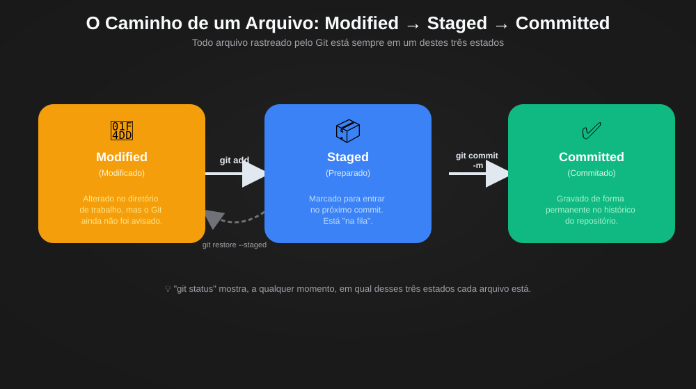
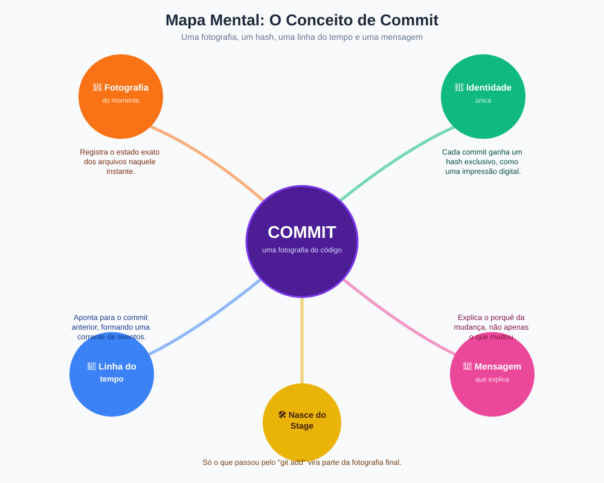
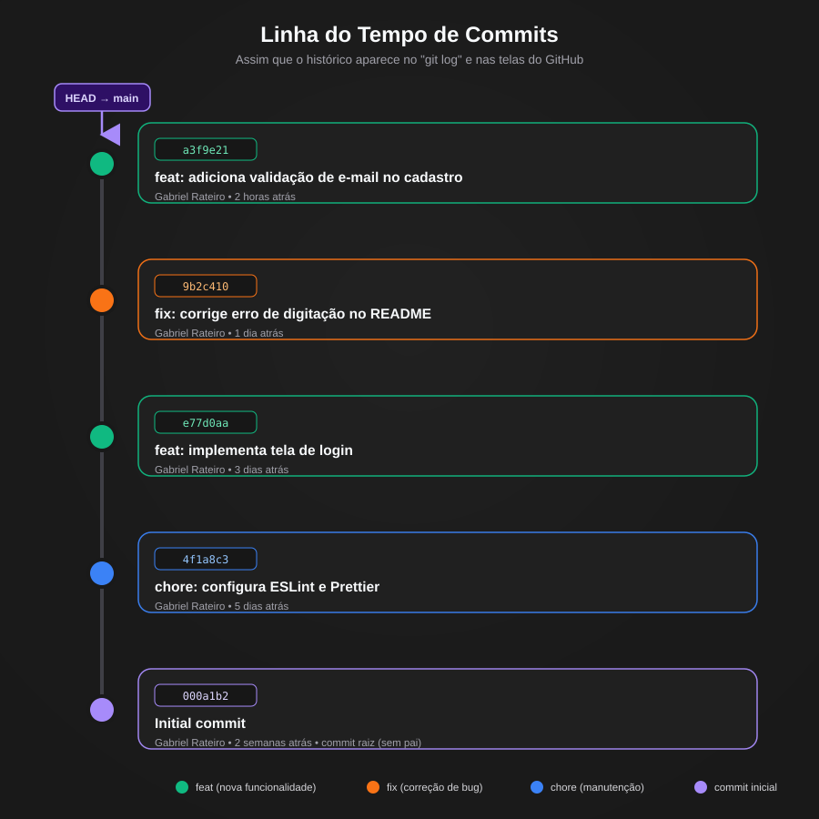
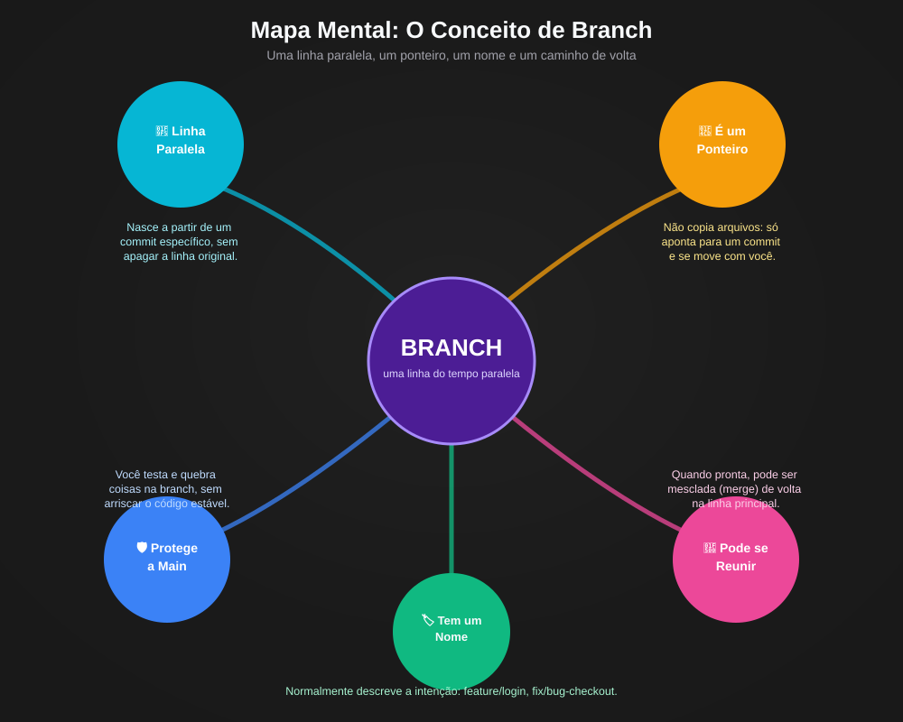
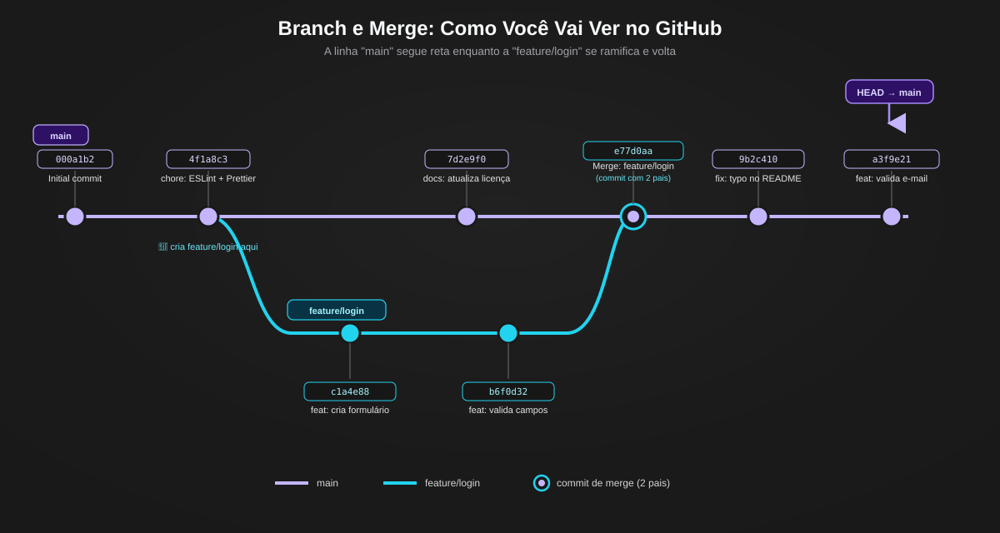

# Conceitos Básicos do Git (Basic Git Concepts)

> Vamos aprender os conceitos básicos do Git para entender como ele funciona e como suas principais estruturas se relacionam.

## Menu de Navegação

* [Repositório](#repositório)
* [Commit](#commit)

  * [O que é um Commit](#o-que-é-um-commit)
  * [Os Três Estados de um Arquivo](#os-três-estados-de-um-arquivo)
  * [Como Isso Aparece na Prática](#como-isso-aparece-na-prática)
  * [Mapa Mental Visual](#mapa-mental-visual)
  * [Linha do Tempo: Como Você Vai Ver no Git e no GitHub](#linha-do-tempo-como-você-vai-ver-no-git-e-no-github)
  * [Por Que Isso Realmente Importa](#por-que-isso-realmente-importa)
  * [Revisão Rápida](#revisão-rápida)
* [O Que É uma Branch](#o-que-é-uma-branch)

  * [A Analogia](#a-analogia)
  * [Como Isso Aparece na Prática](#como-isso-aparece-na-prática-1)
  * [Mapa Mental Visual](#mapa-mental-visual-1)
  * [Como Isso Aparece no GitHub](#como-isso-aparece-no-github)
  * [Por Que Isso Realmente Importa](#por-que-isso-realmente-importa-1)
  * [Revisão Rápida](#revisão-rápida-1)

---

## Repositório

Essencialmente, um repositório Git é um diretório controlado pelo Git que contém uma estrutura interna responsável por armazenar informações sobre o histórico e o estado do projeto.

Quando um repositório é inicializado, o Git cria um diretório chamado `.git` dentro do projeto. É nesse diretório que ficam armazenados os dados usados pelo Git para controlar versões, como commits, referências, configurações e outras informações necessárias para reconstruir o histórico.

O diretório `.git` não é o projeto em si. Ele é a estrutura que permite ao Git acompanhar o projeto.

### Exemplo

Imagine um projeto com esta estrutura:

```text
meu-projeto/
├── index.html
├── style.css
├── script.js
└── .git/
```

Os arquivos `index.html`, `style.css` e `script.js` são os arquivos do projeto.

Já o `.git` é a estrutura interna utilizada pelo Git para registrar e organizar o histórico dessas alterações.

Uma forma simples de visualizar isso é pensar em duas partes:

```text
PROJETO
│
├── Arquivos do projeto
│   ├── index.html
│   ├── style.css
│   └── script.js
│
└── .git
    └── Histórico e informações do Git
```

Assim, o repositório permite que o Git acompanhe a evolução do projeto ao longo do tempo.

---

## Commit

### O que é um Commit

Um commit é um registro do estado do projeto em determinado momento.

Quando é executado:

```bash
git commit
```

o Git cria um novo objeto de commit a partir do conteúdo que foi preparado na área de staging.

Esse registro contém informações importantes, como:

* o estado dos arquivos que foram registrados naquele momento;
* a identificação do autor;
* a data e a hora da criação;
* uma mensagem descritiva;
* uma identificação baseada em hash.

O commit passa a fazer parte do histórico do repositório.

Os objetos armazenados pelo Git não são normalmente alterados depois de criados. Porém, isso não significa que o histórico nunca possa ser reescrito. Existem operações que podem criar uma nova sequência de commits ou alterar referências do histórico. Esse assunto será estudado posteriormente.

### Uma Analogia

Imagine que você esteja escrevendo um livro e queira registrar diferentes momentos da história.

Ao terminar uma parte importante, você faz uma cópia do manuscrito e anota:

> "Capítulo 3 concluído — o personagem principal descobriu o segredo."

Depois, guarda essa versão junto com as anteriores.

Mais tarde, você pode voltar para aquela versão e observar como o livro estava naquele momento.

O commit funciona de maneira semelhante.

Ele registra uma versão específica do projeto naquele ponto da história.

A diferença é que o Git não trabalha com uma simples cópia manual dos arquivos. Ele utiliza uma estrutura própria para armazenar e relacionar as informações do histórico.

---

### Os Três Estados de um Arquivo

Para entender o funcionamento do commit, é importante entender o caminho percorrido pelas alterações.

De forma simplificada, podemos observar três situações principais:

* **Modified (Modificado)** — o arquivo foi alterado no diretório de trabalho e essas alterações ainda não estão preparadas para o próximo commit.
* **Staged (Preparado)** — as alterações foram adicionadas à área de staging usando `git add` e estão preparadas para serem incluídas no próximo commit.
* **Committed (Registrado no histórico)** — as alterações foram registradas em um commit por meio do `git commit`.

Uma representação simplificada é:

```text
Modified
   │
   │ git add
   ▼
Staged
   │
   │ git commit
   ▼
Committed
```



É importante observar que esses estados não representam necessariamente três estados totalmente isolados.

Por exemplo, um arquivo pode ser adicionado ao staging e, depois disso, receber uma nova alteração. Nesse caso, parte das alterações pode estar staged enquanto outra parte continua modificada no diretório de trabalho.

Também existe a situação de arquivos **untracked (não rastreados)**, que ainda não fazem parte do conjunto de arquivos acompanhados pelo Git.

Para retirar uma alteração da área de staging sem apagar o arquivo, podemos usar:

```bash
git restore --staged arquivo.js
```

Nesse caso, a alteração deixa de estar preparada para o próximo commit, mas continua presente no diretório de trabalho.

---

### Como Isso Aparece na Prática

#### 1. Verificar o estado atual

```bash
git status
```

Esse comando mostra informações sobre o estado atual do repositório, incluindo arquivos modificados, preparados, não rastreados e outras situações relevantes.

#### 2. Preparar uma alteração

```bash
git add arquivo.js
```

Esse comando adiciona as alterações do arquivo à área de staging.

#### Sintaxe do comando

| Parte        | Papel      | Explicação                                                 |
| ------------ | ---------- | ---------------------------------------------------------- |
| `git`        | Programa   | Executa o Git                                              |
| `add`        | Subcomando | Indica que uma alteração será adicionada à área de staging |
| `arquivo.js` | Argumento  | Indica o arquivo que será preparado                        |

Para adicionar várias alterações de uma vez, uma forma comum é:

```bash
git add .
```

O ponto representa o diretório atual e faz com que o Git considere as alterações dentro desse caminho, de acordo com as regras do comando e do repositório.

#### 3. Criar o commit

```bash
git commit -m "Corrige bug de validação no formulário de login"
```

Esse comando cria um commit utilizando o conteúdo que está na área de staging.

#### Sintaxe do comando

| Parte              | Papel      | Explicação                                                  |
| ------------------ | ---------- | ----------------------------------------------------------- |
| `git`              | Programa   | Executa o Git                                               |
| `commit`           | Subcomando | Solicita a criação de um commit                             |
| `-m`               | Opção      | Indica que a mensagem será informada diretamente no comando |
| `"Corrige bug..."` | Argumento  | Mensagem associada ao commit                                |

#### 4. Retirar uma alteração do staging

```bash
git restore --staged arquivo.js
```

Esse comando remove a alteração do arquivo da área de staging.

A alteração continua no diretório de trabalho, portanto o arquivo não é apagado nem retorna automaticamente ao conteúdo anterior.

---

### Mapa Mental Visual

Para visualizar a estrutura de um commit, podemos resumir o conceito em cinco ideias principais:



* **📸 Registro de um momento** — representa o estado registrado pelo Git naquele ponto do histórico.
* **🔑 Identificação** — o commit possui um hash que permite identificá-lo.
* **🧬 Relação com o histórico** — commits podem se relacionar com commits anteriores, formando a sequência histórica.
* **💬 Mensagem** — a mensagem ajuda a explicar o objetivo da alteração.
* **🛠️ Surge a partir do staging** — somente o conteúdo preparado na área de staging é considerado na criação do commit.

---

### Linha do Tempo: Como Você Vai Ver no Git e no GitHub

Um commit normalmente não é analisado isoladamente. O Git organiza os commits em uma estrutura de histórico.

Para visualizar esse histórico de forma resumida, podemos usar:

```bash
git log --oneline
```

Esse comando apresenta os commits em uma versão compacta, mostrando informações como o hash abreviado e a mensagem do commit.

Um histórico pode ser visualizado de maneira semelhante a:

```text
a3f9e21 Corrige validação do formulário
7d2e9f0 Adiciona tela de login
4f1a8c3 Cria estrutura inicial
```



Alguns conceitos importantes aparecem nesse histórico.

#### HEAD

`HEAD` é uma referência utilizada pelo Git para indicar a posição atual no histórico.

Na situação mais comum, quando estamos em uma branch, `HEAD` aponta para essa branch, e a branch aponta para o commit atual.

Podemos representar simplificadamente assim:

```text
HEAD
 │
 ▼
main
 │
 ▼
a3f9e21
```

Em outras situações, como quando estamos em **detached HEAD**, o `HEAD` pode apontar diretamente para um commit.

#### Relação entre commits

Os commits formam relações com seus antecessores.

Em um histórico linear:

```text
A ← B ← C ← D
```

O commit `D` foi criado depois de `C`, `C` depois de `B`, e `B` depois de `A`.

O primeiro commit de uma linha histórica é chamado de **commit raiz**, pois não possui um commit pai.

#### Hash curto

Um commit possui um hash completo que funciona como sua identificação.

Em comandos e visualizações, é comum utilizar uma versão abreviada, como:

```text
a3f9e21
```

em vez de apresentar o hash completo.

Esse formato reduzido facilita a leitura e normalmente é suficiente para identificar o commit dentro do contexto do repositório.

---

### Por Que Isso Realmente Importa

Um histórico de commits bem organizado facilita a compreensão da evolução do projeto.

Considere dois cenários.

No primeiro, existe um único commit com uma mensagem genérica:

```text
ajustes
```

Esse commit pode conter alterações em diversos arquivos e funcionalidades diferentes.

No segundo, existem commits separados:

```text
Cria validação do formulário
Adiciona mensagem de erro no login
Corrige alinhamento da tela
Atualiza estilos do botão
```

No segundo caso, cada alteração possui um contexto mais claro.

Isso facilita tarefas como:

* entender o que mudou;
* localizar quando determinada funcionalidade foi alterada;
* investigar a origem de um problema;
* revisar alterações;
* acompanhar a evolução do projeto.

Por isso, commits pequenos, objetivos e com mensagens descritivas tornam o histórico mais fácil de compreender e utilizar.

---

### Revisão Rápida

| Conceito                          | O que significa                                                         |
| --------------------------------- | ----------------------------------------------------------------------- |
| Commit                            | Registro de uma versão do projeto em determinado momento                |
| Hash                              | Identificador gerado para representar um commit                         |
| Staging Area                      | Área em que alterações são preparadas para o próximo commit             |
| Mensagem de commit                | Texto que descreve o objetivo da alteração registrada                   |
| Modified                          | Alteração presente no diretório de trabalho                             |
| Staged                            | Alteração preparada para o próximo commit                               |
| Committed                         | Alteração registrada no histórico por meio de um commit                 |
| Untracked                         | Arquivo que ainda não está sendo rastreado pelo Git                     |
| `git status`                      | Mostra o estado atual do repositório                                    |
| `git add arquivo.js`              | Adiciona alterações do arquivo à área de staging                        |
| `git commit -m "..."`             | Cria um commit com a mensagem informada                                 |
| `git restore --staged arquivo.js` | Remove a alteração da área de staging sem apagar a alteração do arquivo |
| `git log --oneline`               | Exibe o histórico de commits de forma resumida                          |
| HEAD                              | Referência que indica a posição atual no histórico                      |
| Commit raiz                       | Primeiro commit de uma linha de histórico, sem commit pai               |

---

# O Que É uma Branch?

Uma **branch** é uma referência que permite trabalhar com uma linha de desenvolvimento dentro do histórico do repositório.

Ela normalmente aponta para um commit específico e acompanha os novos commits criados nessa linha.

Por exemplo:

```text
A ← B ← C
          ↑
         main
```

Nesse momento, `main` aponta para `C`.

Se uma nova branch for criada:

```text
A ← B ← C
          ↑
       main
          ↑
      feature/login
```

As duas branches inicialmente apontam para o mesmo commit.

Quando novos commits são criados na `feature/login`, a branch começa a avançar independentemente:

```text
A ← B ← C ← D ← E
          ↑
        main

              ↑
        feature/login
```

Nesse exemplo, `main` continua apontando para `C`, enquanto `feature/login` avançou para `E`.

### Um ponto importante

Criar uma branch não significa duplicar fisicamente o projeto inteiro.

Uma branch é essencialmente uma referência leve dentro do histórico do Git.

Os arquivos do diretório de trabalho são ajustados quando a posição atual é alterada para outra branch.

Isso permite criar e utilizar várias linhas de desenvolvimento sem precisar manter uma cópia completa e independente do repositório para cada branch.

Os nomes das branches normalmente ajudam a identificar a finalidade daquela linha de desenvolvimento.

Exemplos:

```text
feature/login
feature/carrinho
fix/erro-checkout
refactor/autenticacao
```

---

### A Analogia

Imagine novamente um livro.

Existe uma versão principal do manuscrito chamada `main`.

Em determinado momento, você quer testar uma mudança importante na história.

Em vez de alterar diretamente o manuscrito principal, você cria uma nova linha de desenvolvimento a partir daquele ponto.

A partir daí, essa nova linha pode receber alterações e novos capítulos sem modificar imediatamente a linha principal.

Podemos imaginar:

```text
História principal
A → B → C

Nova possibilidade
        ↘ D → E
```

Se essa nova versão funcionar, ela pode ser integrada à linha principal.

Se não funcionar, essa linha pode simplesmente deixar de ser utilizada.

Essa é uma forma simples de visualizar o propósito de uma branch: permitir que diferentes linhas de desenvolvimento existam dentro do mesmo histórico.

---

### Como Isso Aparece na Prática

#### 1. Ver as branches existentes

```bash
git branch
```

Esse comando lista as branches locais do repositório.

A branch atual normalmente aparece marcada com um `*`.

Exemplo:

```text
* main
  feature/login
  fix/header
```

#### 2. Criar uma nova branch

```bash
git branch feature/login
```

Esse comando cria uma nova branch apontando para o commit atual.

Ele não troca automaticamente para a nova branch.

#### Sintaxe do comando

| Parte           | Papel      | Explicação            |
| --------------- | ---------- | --------------------- |
| `git`           | Programa   | Executa o Git         |
| `branch`        | Subcomando | Trabalha com branches |
| `feature/login` | Argumento  | Nome da nova branch   |

#### 3. Trocar para outra branch

```bash
git switch feature/login
```

Esse comando altera a branch atual para `feature/login`.

#### Sintaxe do comando

| Parte           | Papel      | Explicação                          |
| --------------- | ---------- | ----------------------------------- |
| `git`           | Programa   | Executa o Git                       |
| `switch`        | Subcomando | Solicita a troca de branch          |
| `feature/login` | Argumento  | Branch para a qual o Git deve mudar |

Em versões e materiais mais antigos, também é possível encontrar:

```bash
git checkout feature/login
```

`git checkout` possui várias funções e historicamente também era utilizado para trocar de branch.

O comando `git switch` foi introduzido para deixar especificamente essa operação mais clara.

#### 4. Criar e trocar para uma branch ao mesmo tempo

```bash
git switch -c feature/login
```

Nesse caso, o Git cria a branch e já muda para ela.

#### Sintaxe

| Parte           | Papel      | Explicação                     |
| --------------- | ---------- | ------------------------------ |
| `git`           | Programa   | Executa o Git                  |
| `switch`        | Subcomando | Trabalha com a troca de branch |
| `-c`            | Opção      | Cria uma nova branch           |
| `feature/login` | Argumento  | Nome da branch criada          |

#### 5. Fazer merge

Para integrar uma branch em outra, primeiro é necessário estar na branch que receberá as alterações.

Por exemplo:

```bash
git switch main
```

Depois:

```bash
git merge feature/login
```

Nesse caso, o conteúdo e o histórico alcançável pela `feature/login` são integrados à `main`.

Dependendo da situação, o Git pode realizar um **fast-forward**, simplesmente avançando a referência da branch de destino, ou pode criar um **merge commit** para representar a união de históricos distintos.

---

### Mapa Mental Visual

Para fixar o conceito de branch, podemos resumir a ideia em cinco pontos:



* **🧵 Linha de desenvolvimento** — representa uma sequência de commits dentro do histórico.
* **📍 É uma referência** — a branch aponta para um commit.
* **🛡️ Isola alterações** — permite desenvolver mudanças sem alterar imediatamente outra linha do projeto.
* **🔀 Pode ser integrada** — uma branch pode posteriormente ser mesclada com outra.
* **🏷️ Possui um nome** — o nome ajuda a identificar a finalidade daquela linha.

---

### Como Isso Aparece no GitHub?

Quando várias branches existem ao mesmo tempo, o histórico pode apresentar caminhos diferentes.

Podemos visualizar esse histórico no terminal com:

```bash
git log --graph --oneline --all
```

Esse comando apresenta os commits de forma resumida e adiciona uma representação gráfica das diferentes linhas do histórico.



Um exemplo simplificado seria:

```text
*   e77d0aa Merge branch 'feature/login'
|\
| * b6f0d32 Implementa validação do login
| * c1a4e88 Cria formulário de login
* | 7d2e9f0 Atualiza página inicial
|/
* 4f1a8c3 Cria estrutura inicial
```

Nesse exemplo:

* `main` continuou recebendo alterações enquanto a `feature/login` também recebia novos commits;
* a `feature/login` nasceu a partir de `4f1a8c3`;
* novos commits foram criados nessa branch;
* a `main` também avançou;
* posteriormente, as duas linhas foram integradas.

O commit `e77d0aa` representa um **merge commit**. Nesse caso, ele possui dois commits pais, representando os dois históricos que foram unidos.

É importante lembrar que nem todo merge produz um commit de merge. Em um **fast-forward**, por exemplo, a branch de destino pode simplesmente avançar para um commit que já pertence à outra linha.

No GitHub, a ideia de integração entre branches pode aparecer em diferentes contextos, como em pull requests e no histórico de commits.

Também é importante não associar todo pull request mesclado obrigatoriamente a um merge commit, porque existem diferentes estratégias de integração, como merge, squash e rebase.

---

### Por Que Isso Realmente Importa?

Branches ajudam a organizar diferentes linhas de desenvolvimento dentro do mesmo projeto.

Em um projeto com várias funcionalidades sendo desenvolvidas simultaneamente, trabalhar diretamente em uma única linha pode dificultar a separação das alterações.

Com branches, é possível organizar o trabalho de forma mais clara:

```text
main
│
├── feature/login
├── feature/carrinho
├── fix/erro-checkout
└── refactor/autenticacao
```

Cada branch representa uma linha de desenvolvimento que pode evoluir separadamente.

Quando uma alteração estiver pronta, ela pode ser revisada, testada e posteriormente integrada à linha desejada.

Isso torna a organização do histórico mais previsível e facilita o desenvolvimento de diferentes mudanças ao mesmo tempo.

---

### Revisão Rápida

| Conceito                          | O que significa                                                                      |
| --------------------------------- | ------------------------------------------------------------------------------------ |
| Branch                            | Referência que representa uma linha de desenvolvimento dentro do histórico           |
| Ramificar                         | Criar uma nova linha de desenvolvimento a partir de um ponto do histórico            |
| HEAD                              | Referência que indica a posição atual no histórico                                   |
| Merge                             | Operação utilizada para integrar uma linha de desenvolvimento a outra                |
| `git branch`                      | Lista branches locais ou permite criar e gerenciar branches                          |
| `git branch nome`                 | Cria uma branch sem trocar para ela                                                  |
| `git switch nome`                 | Troca para a branch informada                                                        |
| `git switch -c nome`              | Cria uma branch e já troca para ela                                                  |
| `git checkout nome`               | Comando tradicional que também pode ser usado para trocar de branch                  |
| `git merge nome`                  | Integra a branch informada à branch atual                                            |
| `git log --graph --oneline --all` | Exibe o histórico com uma representação gráfica das diferentes linhas                |
| Merge commit                      | Commit criado para registrar a união de históricos distintos                         |
| Fast-forward                      | Atualização da referência da branch sem necessidade de criar um novo commit de merge |

---
